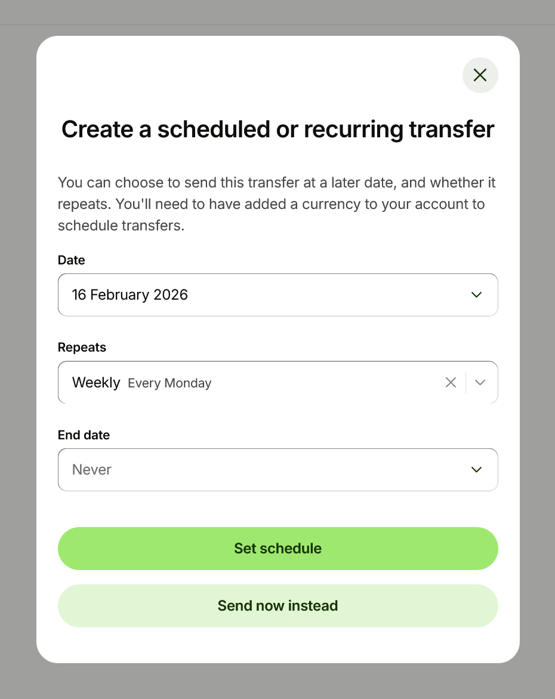
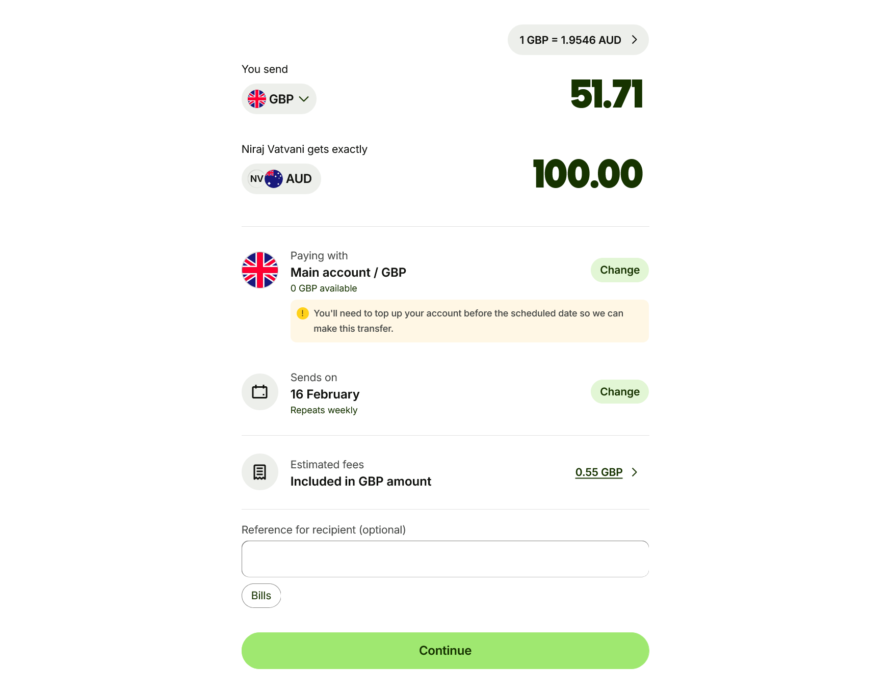
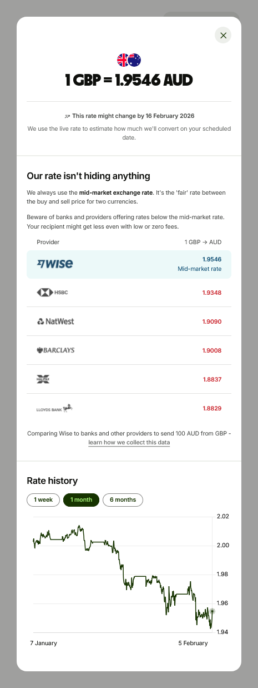

# The Major Gripe with International Money Transfer Apps

*5 February 2026*

Wise, Remitly, Revolut, etc... are all significantly better, both in terms of speed and cost, than traditional banks when it comes to transferring money internationally. But they all have one major annoyance!

## The Problem

Wise is the only platform having the capability to set up recurring conversions. But, it is done as follows:
1. Set up a recurring transfer

2. Select the recipient
3. Set up a frequency (daily, weekly, monthly)

4. You only get to setup either the sent, or received amount.

5. You are never allowed to set a target conversion rate. You are only *warned* that the future rate will differ from the current rate.

None of the platforms provide the means for users to **set-and-forget** a recurring fx-transfer or fx-conversion that is executed only when the exchange rate is within a certain band of the target rate.

Whatever the frequency of the transfers, the platforms expect the users to manually set the target-conversion-rate, no matter how (un)realistic, and then apply the (un)realistic rate when the time comes. If you want to change it, you have to cancel the schedule and re-create it all over again!

Here are the actual instructions / limitations from the various platforms:

1. **Wise**: https://wise.com/help/articles/2978063/what-are-scheduled-transfers

2. **Remitly**: *Not Supported*

3. **Revolut**: *Not Supported*

## The Proposal

It is already known that many FinTechs have Risk Management systems in-place to mitigate Currency Risk. It would be safe to assume that Wise, Remitly, Revolut, etc... have similar systems in place. **Why can't they leverage these systems to provide a better user experience?**

The short answer is that it works against their margins with the business model they have in place. So you do need to take Wise's wording below with a pinch of salt:
> Will I get a guaranteed rate?
> 
> The short answer is no, you won’t get a guaranteed rate. This is because you’re requesting that we send the money out later, and we can’t predict the future — as much as we wish we could.
> 
> We’ll send out your transfer on the morning of the scheduled date, using the current mid-market rate at the time.

Yes the future is unpredictable, but current SOTA (State of the Art) Time Series Forecasting models are capable of predicting the future with a certain degree of accuracy; 60-ish percentage accuracy for 1-day ahead prediction to be precise. The accuracy degrades significantly as the prediction horizon increases.

**(To be continued...)**

---

*Feel free to connect with me on [LinkedIn](https://www.linkedin.com/in/nvatvani) to continue the conversation.*