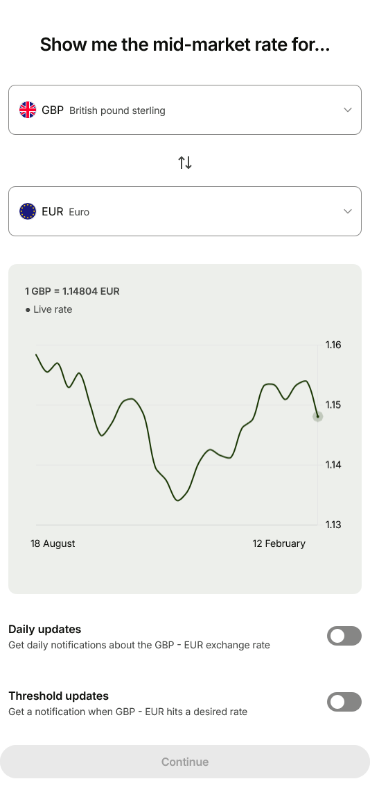
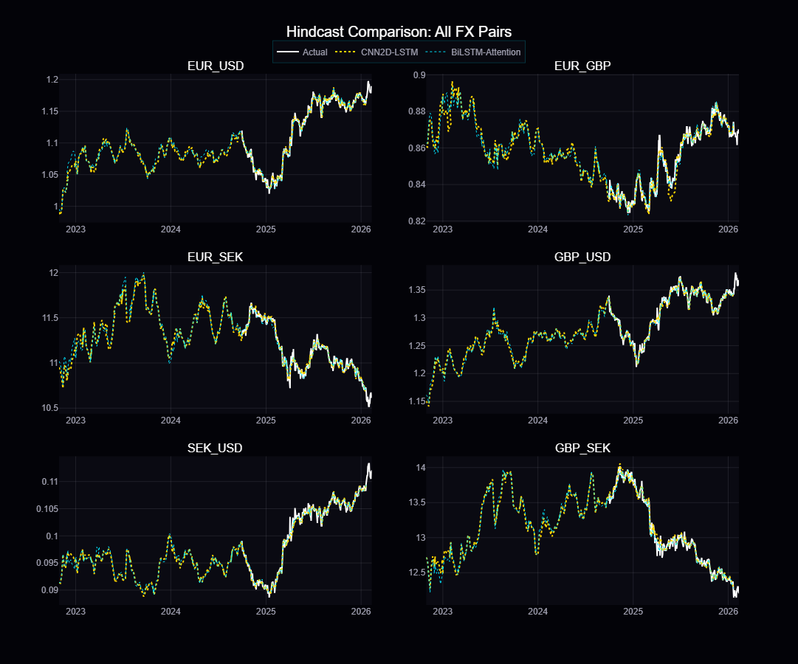

# The Major Gripe with International Money Transfer Apps

*11 February 2026*

Wise, Remitly, Revolut, etc... are all significantly better, both in terms of speed and cost, than traditional banks when it comes to transferring money internationally. But they all have one major annoyance!

## The Problem

Wise is the only platform having the capability to set up recurring conversions. But, it is done as follows:
1. Set up a recurring transfer

2. Select the recipient
3. Set up a frequency (daily, weekly, monthly)

4. You only get to setup either the sent, or received amount. You do not get to set the rate at which the conversion is triggered.

5. You are never allowed to set a target conversion rate. You are only *warned* that the future rate will differ from the current rate.

6. Wise mitigates this inconvenience by allowing you to subscribe to rate alerts, opening you up to getting spammed in your mailbox or phone's notification window courtesy of the Wise app.

None of the platforms provide the means for users to **set-and-forget** a recurring fx-transfer or fx-conversion that is executed only when the exchange rate is within a certain band of the target rate.

Whatever the frequency of the transfers, the platforms expect the users to manually set the target-conversion-rate, no matter how (un)realistic, and then apply the (un)realistic rate (similar to the Wise Rate Alert spamming/notifications) when the time comes. If you want to change it, you have to cancel the schedule and re-create it all over again!

Here are the actual instructions / limitations from the various platforms:

1. **Wise**: https://wise.com/help/articles/2978063/what-are-scheduled-transfers

2. **Remitly**: *Not Supported*

3. **Revolut**: *Not Supported*

## The Proposal

It is already known that many FinTechs have Risk Management systems in-place to mitigate Currency Risk. It would be safe to assume that Wise, Remitly, Revolut, etc... have similar systems in place to manage their individual exposures to currency fluctuations and simultaneously offering speedy International Money Transfers. **Why can't they leverage these systems to provide a better experience for the user?**

The short answer is that it works against their margins with the business model they have in place. So you do need to take Wise's wording below with a pinch of salt:
> Will I get a guaranteed rate?
> 
> The short answer is no, you won’t get a guaranteed rate. This is because you’re requesting that we send the money out later, and we can’t predict the future — as much as we wish we could.
> 
> We’ll send out your transfer on the morning of the scheduled date, using the current mid-market rate at the time.

Yes the future is unpredictable, but current SOTA (State of the Art) Time Series Forecasting models are capable of predicting the future with a certain degree of accuracy; 60-ish percentage accuracy for 1-day ahead prediction to be precise with some methods proposing high 80s percentage accuracy. This accuracy degrades significantly as the prediction horizon increases, i.e. - the precision of the 1-day ahead prediction is significantly higher than that of the 5-day ahead prediction, which in turn is significantly higher than that of the 10-day ahead prediction, and so on.

So if you plan to transfer money internationally, say once a month, you neeed to take into account the fact that the accuracy of the prediction for the day you plan to transfer the money is going to be significantly lower than if you were to transfer money internationally once a day.

The main base-cases for this recurrent international transfers are:
1. Remittance by overseas workers to their families back home
2. Businesses buying regular items from overseas suppliers

The current volatility of global markets due to unpredictable geopolitical events is making it even more important to have a better experience when it comes to international money transfers.

## The Proof and means to Remedy the annoyance

So how do we go about overcoming this annoyance?

Instead of forecasting EV charging schedules as was the casein my previous work, we can instead forecast the exchange rate for the 20-business-days we plan to do an international money transfer.

The forecast is available [here](forecast.html) and
is based on the trained model below:

---

*Feel free to connect with me on [LinkedIn](https://www.linkedin.com/in/nvatvani) to continue the conversation.*